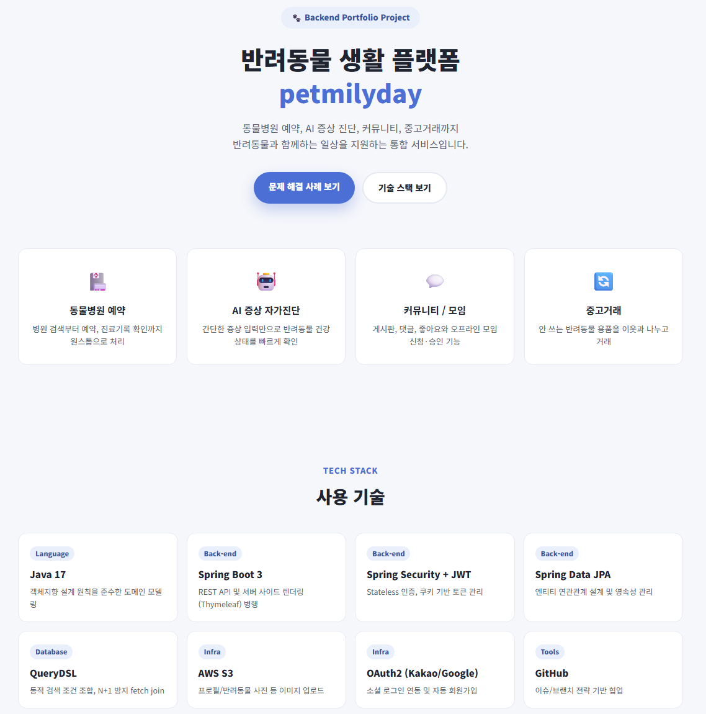
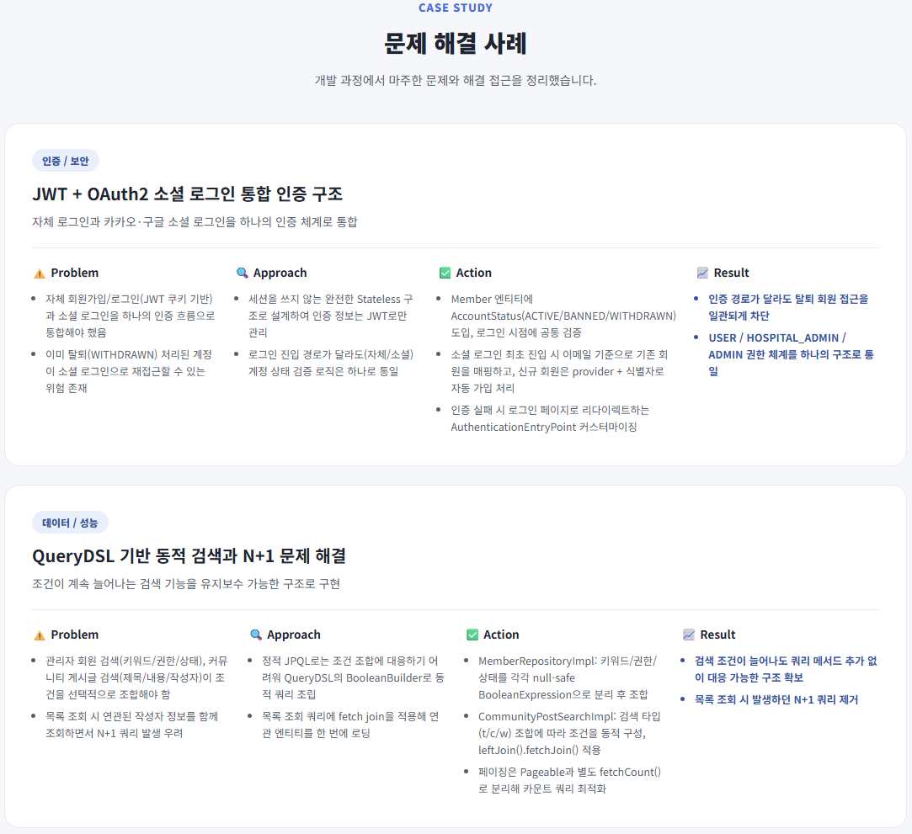

# portfolio

개인 포트폴리오 사이트입니다. Spring Boot + Thymeleaf로 구성되어 있으며,
별도 DB 없이 서버 코드 내 데이터로 페이지를 렌더링합니다.

## 스크린샷





## 페이지 구조

| 경로 | 설명 |
|---|---|
| `/` | 자기소개 (이름, 한 줄 소개, 프로젝트 카드 목록) |
| `/projects/petmilyday` | petmilyday 프로젝트 상세 (기능 소개, 기술 스택, 문제 해결 사례) |

## 실행 방법 (IntelliJ)

1. IntelliJ에서 `File > Open`으로 이 폴더를 엽니다. Maven 프로젝트로 자동 인식됩니다.
2. `PortfolioApplication.java`를 열고 실행(▶) 버튼을 누릅니다.
3. 브라우저에서 `http://localhost:8090` 접속.

## 프로젝트 구조

```
src/main/java/com/petmilyday/portfolio
 ├─ PortfolioApplication.java
 ├─ config/GlobalModelAttributes.java   # 모든 페이지에 프로필(연락처) 정보 공통 주입
 ├─ controller/
 │   ├─ HomeController.java             # "/" 자기소개 페이지
 │   └─ ProjectController.java          # "/projects/{slug}" 프로젝트 상세 페이지
 ├─ data/PortfolioData.java             # 프로필, 프로젝트 카드, 프로젝트 상세 콘텐츠 관리
 └─ dto/                                # 화면에 뿌릴 데이터 모델

src/main/resources
 ├─ templates/index.html                # 자기소개 페이지
 ├─ templates/project-detail.html       # 프로젝트 상세 페이지
 ├─ templates/fragments/                # 헤더/푸터 공통 조각
 └─ static/css/style.css                # 전체 스타일
```

## 콘텐츠 수정하기

- **자기소개(이름/한줄소개/연락처)**: `data/PortfolioData.java`의 `profile()` 메서드
- **홈 화면 프로젝트 카드**: 같은 파일의 `projectSummaries()` 메서드
- **petmilyday 상세 내용**: 같은 파일의 `petmilydayDetail()` 메서드
  (기능 소개 / 기술 스택 / 문제 해결 사례 모두 여기서 관리)
